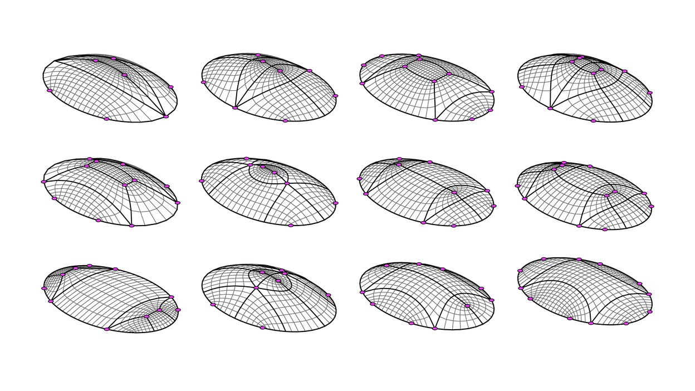

********************************************************************************
Introduction
********************************************************************************

About
=====

Hello and welcome to the documentation of ``compas_pattern``, a Python library developed for the topological design of the singularities in quad-mesh patterns.

``compas_pattern`` is a Package of the `COMPAS <https://compas-dev.github.io/>` framework.

``compas_pattern``stems from the doctoral research of Robin Oval at Université Paris-Est in a collaboration between Laboratoire Navier and ETH Zurich, funded by l'École des Ponts ParisTech and the Block Research Group, under the supervision of Prof Olivier Baverel and Prof Philippe Block, as well as Dr Romain Mesnil, Dr Matthias Rippmann and Dr Tom Van Mele.

This figure shows that even for a simple shape like an elliptic dome, a rich combinatorial design space is to be explored regarding singularities (in pink) in coarse quad meshes (in black).

Motivation
==========

Shell-like structures allow to elegantly and efficiently span large areas. Quad meshes are natural patterns to represent these surface objects, which can also serve for mapping other patterns. Patterns for these shells, vaults, gridshells or nets can represent the materialised structure, the force equilibrium or the surface map. The topology of these patterns constrains their qualitative and quantitative modelling freedom for geometrical exploration. Unless topological exploration is enabled.
Parametric design supporting exploration and optimisation of the geometry of structures is spreading across the community of designers and builders. Unfortunately, topological design is lagging, despite some optimisation-oriented strategies for specific design objectives. Strategies, algorithms and tools for topological exploration are necessary to tackle the multiple objectives in architecture, engineering and construction for the design of structures at the architectural scale. The task of structural design is rich and complex, calling for interactive algorithms oriented towards co-design between the human and the machine. Such an approach is complementary and empowered with existing methods for geometrical exploration and topology optimisation.
The present work introduces topology finding for efficient search across the topological design space. This thesis builds on three strategies for topology finding of singularities in quad-mesh patterns, presented from the most high-level to the most low-level approach.

**Geometry-coded exploration** relies on a skeleton-based quad decomposition of a surface including point and curve features. These geometrical parameters can stem from design heuristics to integrate into the design, related to the statics system or the curvature of the shell, for instance.

**Graph-coded exploration** relies on the topological strips in quad meshes. A grammar of rules allows exploration of this strip structure to search the design space. A similarity-informed search algorithm finds design with different degrees of topological similarity. Designs optimised for single objectives can inform this generation process to obtain designs offering different trade-offs between multiple objectives. A two-colour search algorithm finds designs that fulfil a two-colouring requirement of two-colouring. This topological property allows a partition of the pattern elements that many structural systems necessitate.

**String-coded exploration** relies on the translation of the grammar rules into alphabetical operations, shifting encoding from a phenotype mesh to a genotype string. Modifications, or mutations, of the string transform the genotype and change the phenotype of the design. String or vector encoding opens for the use of search and optimisation algorithms, like linear programming, genetic algorithms or machine learning.