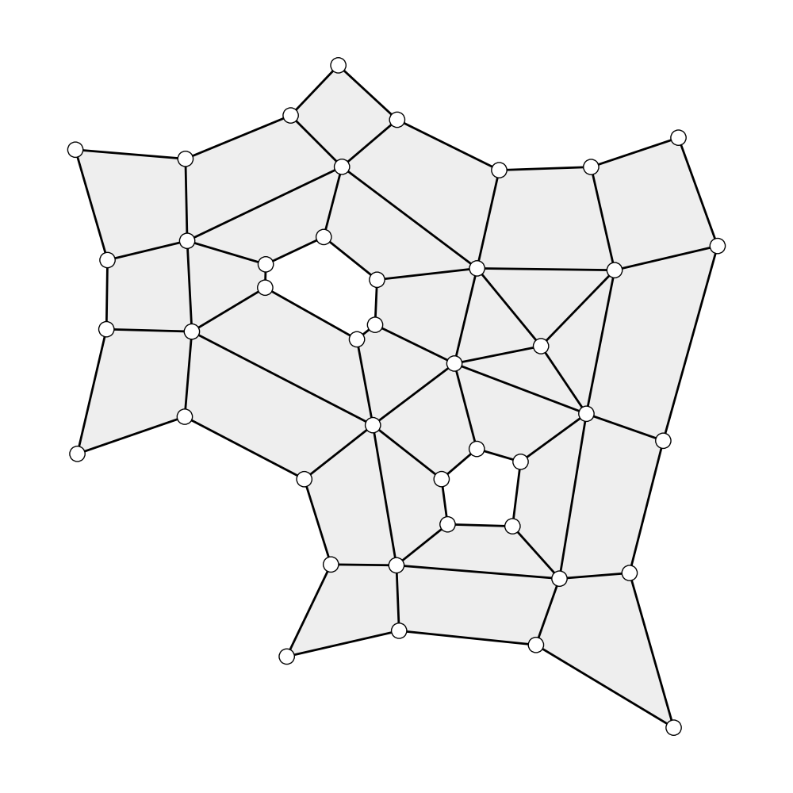
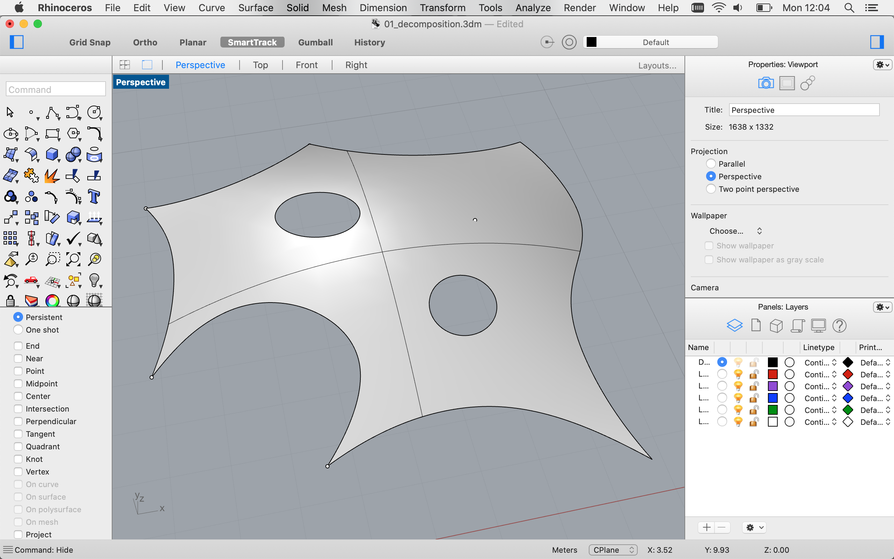

****************************
Skeleton-based decomposition
****************************

This example shows how to decompose a surface into a coarse quad mesh using its topological skeleton.

The algorithm stems from this paper:
Feature-based topology finding of patterns for shell structures
*by* Robin Oval, Matthias Rippmann, Romain Mesnil, Tom Van Mele, Olivier Baverel, Philippe Block

.. code-block:: latex

    @article{oval2019feature,
      title={Feature-based topology finding of patterns for shell structures},
      author={Oval, Robin and Rippmann, Matthias and Mesnil, Romain and Van Mele, Tom and Baverel, Olivier and Block, Philippe},
      journal={Automation in Construction},
      volume={103},
      pages={185--201},
      year={2019},
      publisher={Elsevier}
    }

|

----

From planar discrete polylines
==============================

    Skeleton-based decomposition of a set of planar discrete polylines.

.. literalinclude:: ../../examples/01_decomposition_discrete_planar.py

|

----

From curved continuous objects (in Rhino)
=========================================

    Input surface with features in Rhino.

.. figure:: ../_images/01_decomposition_3.png
    :width: 100%

    Skeleton-based decomposition of the curved surface with features.

.. literalinclude:: ../../examples/01_decomposition_continuous_curved.py
